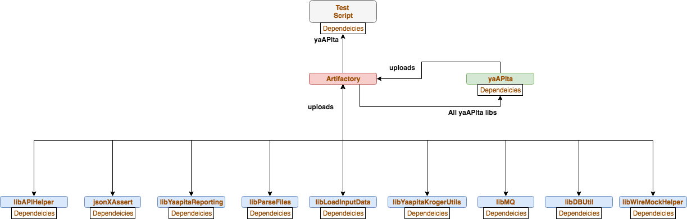
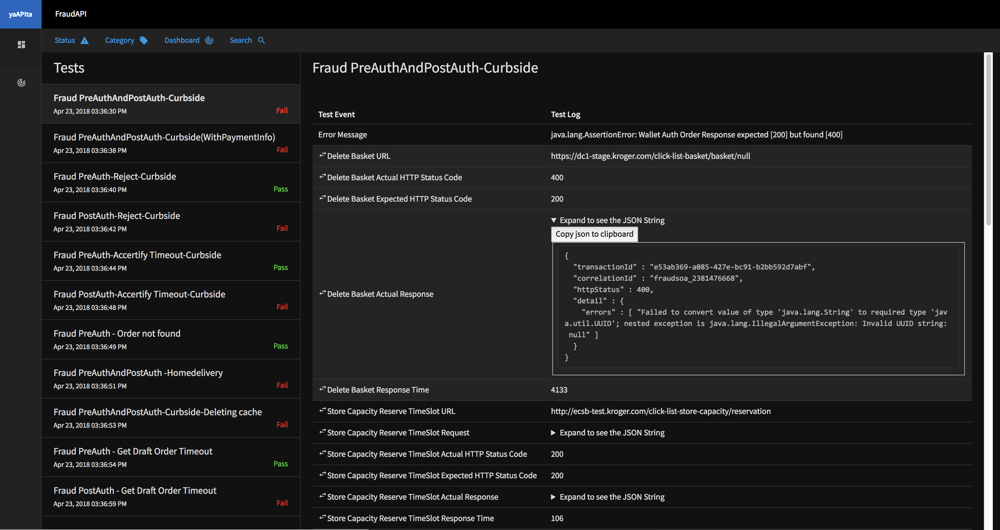
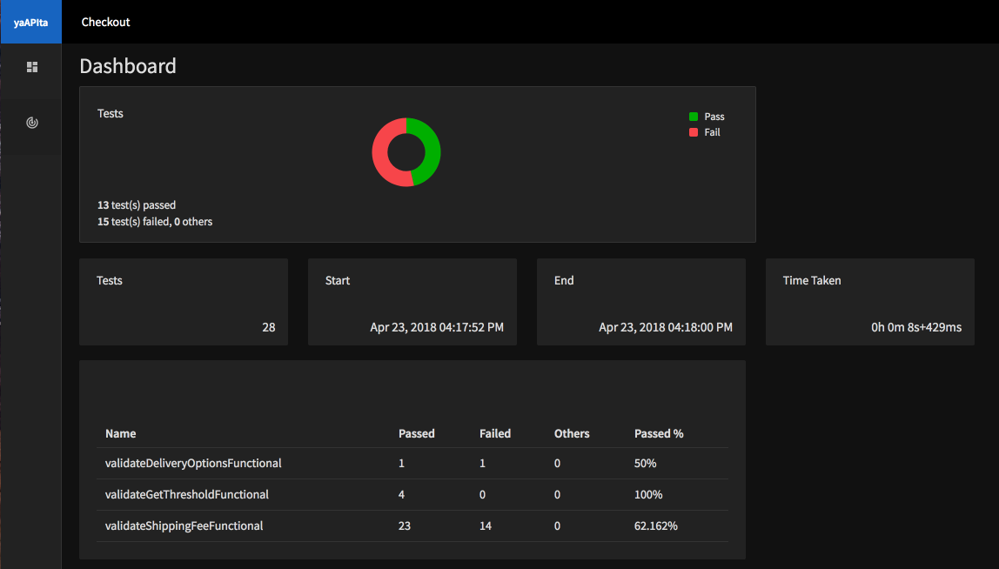

#HSLIDE

## What is yaAPIta?

- API integration testing framework
- Based on Rest Assured, TestNG, Java
- Collection of libraries

#VSLIDE

## Why?

- Open Source
- Data Driven
- Extensible
- Collaboration (Devs, QA)
- Detailed reporting
- Easy debugging

Note: Developers will be able to setup the script and run without testers interference. Since it is Java, anyone can understand. Easy to on-board.

#VSLIDE

## Architecture



#VSLIDE

## How yaAPIta? - build.gradle

```
group 'com.kroger.mobile.service.checkout'
version '1.0-SNAPSHOT'

apply plugin: 'java'

sourceCompatibility = 1.8

repositories {
    maven { url "http://artifactory.kroger.com/artifactory/libs-release" }
}

dependencies {
    testCompile group: 'com.org.yaapita', name: 'yaapita', version: '1.0.0'
}

test{
    systemProperty 'env', System.properties['env']
    testLogging.showStandardStreams = true
    useTestNG(){
        suites 'src/test/resources/testng.xml'
    }
    reports.html.destination = file("$buildDir/reports/testng")
}
```

@[12-14] (One dependency in your script)
@[19-21] (TestNG)

#VSLIDE

## How yaAPIta? - testng.xml


```
<!DOCTYPE suite SYSTEM "http://testng.org/testng-1.0.dtd" >

<suite name="Regression" verbose="1" >
    <listeners>
        <listener class-name="com.org.yaapita.yaapitaListener"/>
    </listeners>
    <test name="Regression" >
        <classes>
            <class name="com.kroger.dcp.checkout.fraud.services.fraudServiceTest" />
        </classes>
    </test>
</suite>

<suite name="Smoke" verbose="1" >
    <listeners>
        <listener class-name="com.org.yaapita.yaapitaListener"/>
    </listeners>
    <test name="Smoke" >
        <classes>
            <class name="com.kroger.dcp.checkout.fraud.services.fraudServiceTestSmoke" />
        </classes>
    </test>
</suite>
```

@[3-12] (Regression Suite)
@[14-23] (Smoke Suite)

#HSLIDE

### Reporting

Initialize report
```
libReporting report = new libReporting("CPS_Create");
```
<br/>

Log data to report
```
report.putData("cardID", "2342423");
report.putServiceData("CPS Create Profile",url,request, actualHTTPResponseCode, expectedHTTPResponseCode, actualResponse, expectedResponse, responseTime);
```

Note: Consolidate HTML report. Logs of all events reported from the script.  Create report object at calss level and initialize it in the suite setup. Use it in the test method.

#VSLIDE

### Reporting - Test View



Note: JSONs automatically formatted. Option to copy json to clipboard. Service calls distinctly visible. Dashboard view

#VSLIDE

### Reporting - Dashboard View



Note: Quick snapshot of the test results. Can be used for BAs, Scrum masters and other non-technical person in the team.
    
#HSLIDE

## yaAPIta in Kroger

- Kroger Technology, Digital, Merchandising, Marketing
- Most of the Clicklist teams
- THOR
- Village People
- Autobots
- Decepticons
- Dinabots
- Predacons
- Night's Watch
- Nerf Herders ...