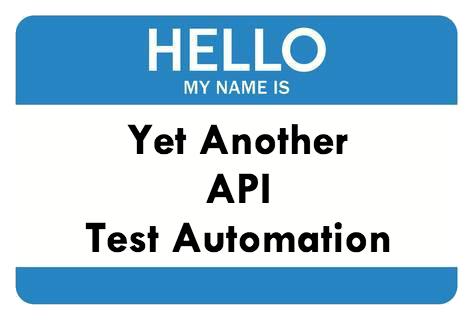
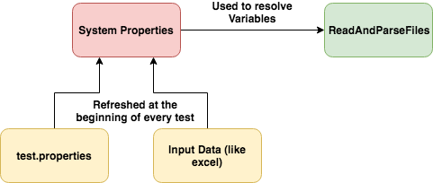
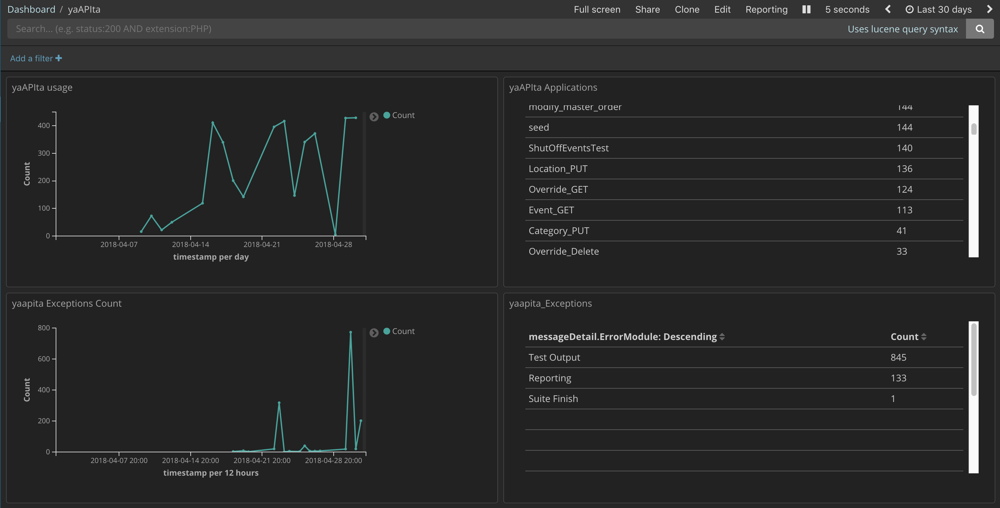

#HSLIDE

# yaAPIta Contributors

#VSLIDE

## Contributors

- Kalayana Peddiraju
- Eswari Kureti
- Naren Gotur
- Saurabh Srivastav
- Kumar Bellamkonda

#HSLIDE

# yaAPIta

#VSLIDE

## Why the name?



#VSLIDE

## What is yaAPIta?

- API integration testing framework
- Based on Rest Assured, TestNG, Java
- Collection of libraries

#VSLIDE

## Why?

- Open Source
- Extensible
- Collaboration (Devs, QA)
- Detailed reporting
- Easy debugging

Note: Developers will be able to setup the script and run without testers interference. Since it is Java, anyone can understand. Easy to on-board.

#VSLIDE

## Architecture


#VSLIDE

## How yaAPIta? - build.gradle

```
group 'com.kroger.mobile.service.checkout'
version '1.0-SNAPSHOT'

apply plugin: 'java'

sourceCompatibility = 1.8

repositories {
    maven { url "http://artifactory.kroger.com/artifactory/libs-release" }
}

dependencies {
    testCompile group: 'com.org.yaapita', name: 'yaapita', version: '1.0.0'
}

test{
    systemProperty 'env', System.properties['env']
    testLogging.showStandardStreams = true
    useTestNG(){
        suites 'src/test/resources/testng.xml'
    }
    reports.html.destination = file("$buildDir/reports/testng")
}
```

@[12-14] (One dependency in your script)
@[19-21] (TestNG)

#VSLIDE

## How yaAPIta? - testng.xml


```
<!DOCTYPE suite SYSTEM "http://testng.org/testng-1.0.dtd" >

<suite name="Regression" verbose="1" >
    <listeners>
        <listener class-name="com.org.yaapita.yaapitaListener"/>
    </listeners>
    <test name="Regression" >
        <classes>
            <class name="com.kroger.dcp.checkout.fraud.services.fraudServiceTest" />
        </classes>
    </test>
</suite>

<suite name="Smoke" verbose="1" >
    <listeners>
        <listener class-name="com.org.yaapita.yaapitaListener"/>
    </listeners>
    <test name="Smoke" >
        <classes>
            <class name="com.kroger.dcp.checkout.fraud.services.fraudServiceTestSmoke" />
        </classes>
    </test>
</suite>
```

@[3-12] (Regression Suite)
@[14-23] (Smoke Suite)

#HSLIDE

# Libraries

#HSLIDE

# API Helper

#VSLIDE

### API Helper

```java
requestBuilder requestBuilder = new requestBuilder("POST","corr_12345","https://mockapi-test.cfcdcinternaltest.kroger.com/APITest/", "Basic ob30f834fp38fybqebwe",body);
restResponse restResponse = getRestResponse(requestBuilder);

//Get Response Body
String responseBody = restResponse.getResponse().asString();

//Get HTTP Response
Srting httpResponseCode = restResponse.getStatusCode();

//Get Response Time
int responseTime = restResponse.getResponseTime();

//Get Response Headers
Headers headers = restResponse.getHeaders();
```
@[1] (Build a request)
@[2] (Make the API call)
@[4-5] (Get the Response body)
@[7-8] (Get the Response HTTP Status Code)
@[10-11] (Get the Response Time)
@[13-14] (Get the Response Headers)

Note: Make REST calls easier. The response object has the complete response body, headers, HTTP Status code and response time information. Request Builder is overloaded method with various combinations of API request.

#VSLIDE

### API Helper

https://gitlab.kroger.com/yaapita/libApiRestHelper

#HSLIDE

# Input Data

#VSLIDE

### QA team walks in to a bar
<font size=6>
- Functional tester orders 0 beer |
- Manual tester orders (-1) beer |
- Performance tester orders 999999 beers |
- Automation tester orders a deer | 
- SOA Tester orders beer with name "kIsSmEyErbArReLReSeRvEDaRksIdEOftHemOoNImPeRiAlpOrTeR" |
- WHO GOT BEER? |

#VSLIDE

#### of course - the SOA tester

```java
"kIsSmEyErbArReLReSeRvEDaRksIdEOftHemOoNImPeRiAlpOrTeR"
"Kissmeyer barrel reserve dark side of the moon imperial porter"
```


#VSLIDE

### Load Input Data

Excel
```java
getEnabledTests("/src/test/Resources/testExcel.xlsx","testSheet");
```

CSV
```java
getEnabledCsvTests("/src/test/Resources/testCsvInput.csv")
```

JSON
```java
getEnabledJsonTests("/src/test/Resources/testJSONInput.json")
```


Note: Explain data driven. Explain enabled test (Mandatory columns). Keep sample (README.md) file ready.

#VSLIDE

### Load Input Data

https://gitlab.kroger.com/yaapita/libLoadInputData

#HSLIDE


# Read And Parse Files

#VSLIDE

### Read And Parse Files

- Input can come from either input sheet or properties file
- Sample properties file  

```
fraud_host = https://ecsb-test.kroger.com/checkout-fraud-aggregator

fraud_uri = fraud/v1
fraud_uri_preauth = preauth
fraud_basicauth = Basic YmVuOmJlbnNwYXNzd29yZA==

inputFilePath = /src/test/resources/data/input/
expectedOutputFilePath = /src/test/resources/data/output/

yaapita_retryLimit = 0
```

Note: Supports multiple property files based on environment. Can be configured in yml file.

#VSLIDE


### Read And Parse Files




Note: Advantage - Framework automatically loads property and data input(like excel) to system properties at test start. 

#VSLIDE

### Read And Parse Files

```
readAndParseFile("/src/test/Resources/Data/sampleInput.json");
```

```
{
  "orderId":"{{subOrderID}}",
  "appName": "ClickList",
  "accountNumber": "{{userguid}}",
  "authType": "realTimeAuth",
  "amount": 18.7,
  "paymentMethodId": "{{cardID}}",
  "pickupStoreId": "{{Division}}{{Store}}"
}
```

Note: The variables are parsed from System Properties.
#VSLIDE

### Read And Parse Files

https://gitlab.kroger.com/yaapita/libParseFiles

#HSLIDE

# JSON X Assertion

#VSLIDE

### JSON X Assertion

- jsonXAssertEquals
- jsonXAssertEqualsIgnoreNodes
- jsonXAssertEqualsIgnoreValues
- jsonXAssertEqualsPartial

Note: Sample for ignore value can be timestamp, randomly generated uuids etc.

#VSLIDE

### JSON X Assertion - Ignore

```
java.lang.AssertionError: Response Match :  createdDate
Expected: 2018-04-20T19:54:15.152Z
     got: 2018-05-22T18:25:12.654Z
 ; etag
Expected: 74e8fb93c8fc6354fb913c0ea77b70f8
     got: ebdc235881c3826bbfcccbb59013c44a
```
@[1-3] (creationDate - varies everytime - (ignore the value))
@[4-6] (etag - Randomnly generated value - (ignore the node))

#VSLIDE

### JSON X Assertion - Partial Match

```
ArrayList<String> ignoredNodes = new ArrayList<>();
ignoredNodes.add("subOrderID[*].etag");
ArrayList<String> ignoredValues = new ArrayList<>();
ignoredValues.add("subOrderID[*].creationDate");
jsonXAssertEqualsPartial ("Response Mismatch : ", actualJson, expectedJson, ignoredNodes, ignoredValues, JSONCompareMode.NON_EXTENSIBLE);
```
@[1-2] (etag - Node ignored)
@[3-4] (creationDate - Value ignored)
@[5] (Assertion - include both ArrayList)

Note: jsonPath is given in the ArrayLIst

#VSLIDE

### JSON X Assertion - Report

```
java.lang.AssertionError: Response Match :  
    data.order.orderDetails.cartSize
Expected: 25
     got: 20
 ; data.order.orderDetails.subtotal
Expected: 25
     got: 15
 ; data.order.readyForProcessing
Expected: false
     got: true
```
@[2] (json path of the node mismatched)
@[3-4] (prints the actual and expected value)
#VSLIDE

### JSON X Assertion

https://gitlab.kroger.com/yaapita/jsonxassert

#HSLIDE

# DB Util

#VSLIDE

### DB Util

- Cassandra
- SQL
- Oracle
<br>

```
//Sample Cassandra connection

Session session = getCassandraSession("u060dcsolr41.kroger.com", 9042, "ecomstatus", "ecomstatus_test", "password");

ResultSet rs= executeQuery(session, "select * from ecomstatus.event_data_v2 where division='014' and storenumber='00383' ;");

String db_response = convertCassandraResultSetToJSON(rs);
```

Note: Create a session once and run multiple queries. Optionally convert the response into JSON for comparing with expected response

#VSLIDE

### DB Util

https://gitlab.kroger.com/yaapita/libdbutil

#HSLIDE

# MQ Util

#VSLIDE

### MQ Util

- Create MQ connection
- Put message to mq
- get message from mq
- clear all messages from mq

```
MQQueueManager mq = mqConnect("QM.ECIIB.DEV", "u060eciibd81.kroger.com","CLNT.ECIIB.DEV",1414,"","");

messagePut(mq, "KRG.OMS.ORDER.SYNC.PUBLISH.OUT", "{\"test\": \"This is a test message designed to error out.\"}");

String returnMsg = messageGet(mq, "KRG.DSW.OMS.ERR");

clearQueue(mq,"KRG.DSW.OMS.ERR");
```
#VSLIDE

### MQ Util

https://gitlab.kroger.com/yaapita/libMQ

#HSLIDE

# Reporting

#VSLIDE

### Reporting

Initialize report
```
libReporting report = new libReporting("CPS_Create");
```
<br/>

Log data to report
```
report.putData("cardID", "2342423");
report.putServiceData("CPS Create Profile",url,request, actualHTTPResponseCode, expectedHTTPResponseCode, actualResponse, expectedResponse, responseTime);
```

Note: Consolidate HTML report. Logs of all events reported from the script.  Create report object at calss level and initialize it in the suite setup. Use it in the test method.

#VSLIDE

### Reporting - Test View


Note: JSONs automatically formatted. Option to copy json to clipboard. Service calls distinctly visible. Dashboard view

#VSLIDE

### Reporting - Dashboard View


Note: Quick snapshot of the test results. Can be used for BAs, Scrum masters and other non-technical person in the team.
    
#HSLIDE

# WireMock Helper

#VSLIDE

### WireMock Helper

Add Dynamic Mapping
```java
addDynamicMapping ("\Users\kon7017\File\mappingFile.json"
                    , "mockcheckout-test.cfcdcinternaltest.kroger.com");
```

Delete Dynamic Mapping
```java
deleteDynamicMappings ("2a12532b-299d-4679-aeed-65b755736569, 04ffca91-ff08-9d3f-0706-c0747058d2dd"
                    , "mockcheckout-test.cfcdcinternaltest.kroger.com");
```

Find WireMock Request
```java
 String response = findWireMockRequest("{ \"url\" : \"/icNowImport/7dbdc6ad-fc5d-4e4b-a78b-916f42c92eae\" }"
                    ,"mockcheckout-test.cfcdcinternaltest.kroger.com");
```

Note: Helper to make the ADMIN API calls easier.

#VSLIDE

### WireMock Helper

https://gitlab.kroger.com/yaapita/libWireMockHelper

#HSLIDE

# HELLO WORLD!

#VSLIDE

## yaAPIta Seed

- The seed project to start a new test script
- Docs available on getting started
- Easy to setup and follow
- Branch "```seedCPS```" has completed sample project.

</br>

https://gitlab.kroger.com/yaapita/yaapitaseed


#HSLIDE

# Other Features

#VSLIDE

## RETRY

```
yaapita_retryLimit = 1
```

- Flaky tests can be retried automatically
- Number of retries is customizable
- Only latest run will be reported

Note: Easy to implement. One property does it all. 0 is the default value (no retries). Use caution while using this.

#VSLIDE

## ECHO VALIDATION

```
String jsonResponse = searchEcho("{\n" +
                "  \"size\": 10,\n" +
                "  \"query\": {\n" +
                "    \"bool\": {\n" +
                "      \"must\": [\n" +
                "        {\n" +
                "          \"match\": {\n" +
                "            \"correlationId\": {\n" +
                "              \"query\": \"1523364632303\"\n" +
                "            }\n" +
                "          }\n" +
                "        }\n" +
                "      ]\n" +
                "    }\n" +
                "  }\n" +
                "}","yaapita", "stage");
```

- perform elastic search / validate ECHO logging

#VSLIDE

## ECHO SEND

```
String requestData = "[{\n" +
                "\"type\": \"INFO\",\n" +
                "\"routingKey\": \"yaapita\",\n" +
                "\"message\": \"Echo Search Test\",\n" +
                "\"correlationId\" : \"1523364632303\",\n" +
                "\"messageDetail\": {\n" +
                    "\"yaapitaMessage\": \"Test Message\"\n" +
                "},\n" +
                "\"timestamp\": 1523364632303\n" +
            "}]";
sendDataToEcho (requestData,"stage");
```

- Send any application specific data to custom key.

#HSLIDE

# QA ECHO Dashboard

#VSLIDE

## QA ECHO Dashboard
<br>
- QA Dashboard - required by QA management for test metrics
- Automatically all tests written in yaAPIta are sent to ECHO

#VSLIDE

## QA ECHO Dashboard

```
@BeforeSuite
public void suiteSetup() throws IOException, URISyntaxException, InterruptedException {
    System.setProperty("ApplicationName", "FraudAPI");
    report = new libReporting("Fraud_PreAuth");
}
```
<br>

```
System.setProperty("serviceExecutionMS", String.valueOf(getGuidRestResponse.getResponseTime()));
```

#HSLIDE

# DEMO
##### The demo is done by professional SOA testers. Please don't try this at home.

Note: Folder structure, Dev Test comparison, Run a sample test, Show a report.

#HSLIDE

# Kroger Utils

#VSLIDE

## Kroger Utils

- CPS
    - Create User
    - Get Email from GUID
    - Get GUID from Email
    - Delete User
- Vault
    - Vault Add Card
- Basket
    - Create Basket
    - Delete All Baskets of User

#VSLIDE

## Kroger Utils - CPS Create User

```
JSONObject CPSResponse = new JSONObject(createUser("test"));

String emailAddress = CPSResponse.getString("Email");
String userGuid = CPSResponse.getString("GUID");
String userLoyaltyCardNumber = CPSResponse.getString("loyaltyCardNumber");
```
#VSLIDE

## Kroger Utils

https://gitlab.kroger.com/yaapita/libYaapitaKrogerUtils\

#HSLIDE

# yaAPIta in Digital

#VSLIDE

## yaAPIta in Digital

- THOR
- ODIN
- Village People
- Autobots
- Decepticons
- Dinabots
- Predacons
- Night's Watch
- Nerf Herders ...

#HSLIDE

# YAAPITA USAGE

#VSLIDE

## YAAPITA USAGE

- All usage about the framework is logged to ECHO.
- Also logs all exceptions in framework to ECHO.
- Used to troubleshoot issues in framework

<br><br>
<font size=4>Disclaimer: Yes, we steal your personal information without your consent. 

#VSLIDE

### YAAPITA USAGE


#HSLIDE

# WHO USES YAAPITA

#VSLIDE


#HSLIDE

# Contributions

#VSLIDE

## Contributions
- Want to contribute? 
    - Request dev access
    - Create branch
    - Submit PR
- Fork if needed

#HSLIDE

# yaAPIta's future

#VSLIDE

## yaAPIta's future
- Enhanced parallel execution
- More kroger utils
- Support DB2 and other DBs
- Support Kafka and other mq utils
- Gitlab history support

#HSLIDE

```audience.ask(questions);```
<br>
<font size=5>presenter.answer("Great question! Will add that in yaAPIta V2")
<br><br><br>
<font size=4>There is one more exciting slide (Hang on!)

#HSLIDE

### Coming Soon
# yaapita 2.0.0

#### https://gitlab.kroger.com/yaapita